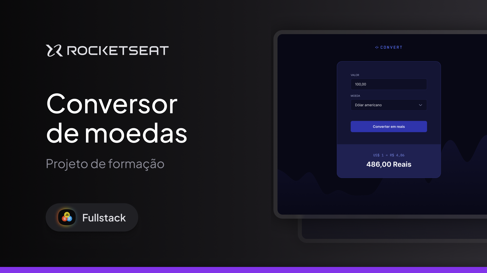

# 💱 Conversor de Moedas – Landing Page

Protótipo de uma landing page para um **Conversor de Moedas**, desenvolvido com foco em interface moderna, organização visual e adaptação para diferentes tamanhos de tela (desktop e mobile).

## 📸 Pré-visualização

> Interface em tema escuro, com destaque para o card de conversão e exibição clara do resultado.

## 🛠 Tecnologias utilizadas
- HTML5
- CSS3
- Layout responsivo (Desktop e Mobile)
- Design moderno com foco em UI

## 🎯 Características do projeto
- Interface simples e intuitiva
- Layout responsivo para diferentes dispositivos
- Card centralizado para conversão de valores
- Destaque visual para o botão de conversão
- Exibição clara do resultado da conversão

## ▶️ Como visualizar o projeto
1. Baixe ou clone este repositório
2. Abra o arquivo `index.html` no navegador

## 📚 Aprendizados
- Construção de interfaces focadas em usabilidade
- Organização de layout com CSS
- Criação de componentes reutilizáveis
- Hierarquia visual para formulários
- Responsividade aplicada a layouts centralizados

## 🚀 Próximos passos
- Implementar JavaScript para realizar a conversão de moedas
- Integrar API de câmbio em tempo real
- Adicionar animações suaves nas interações
- Melhorar acessibilidade (labels, contraste e navegação por teclado)
